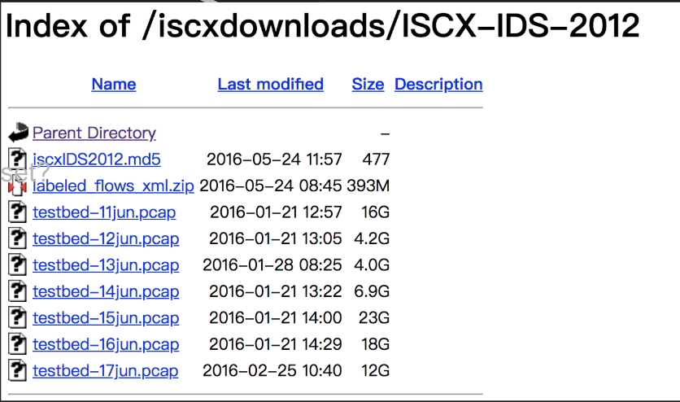
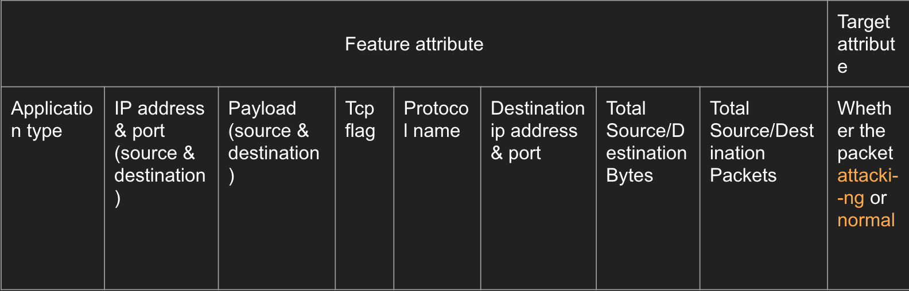
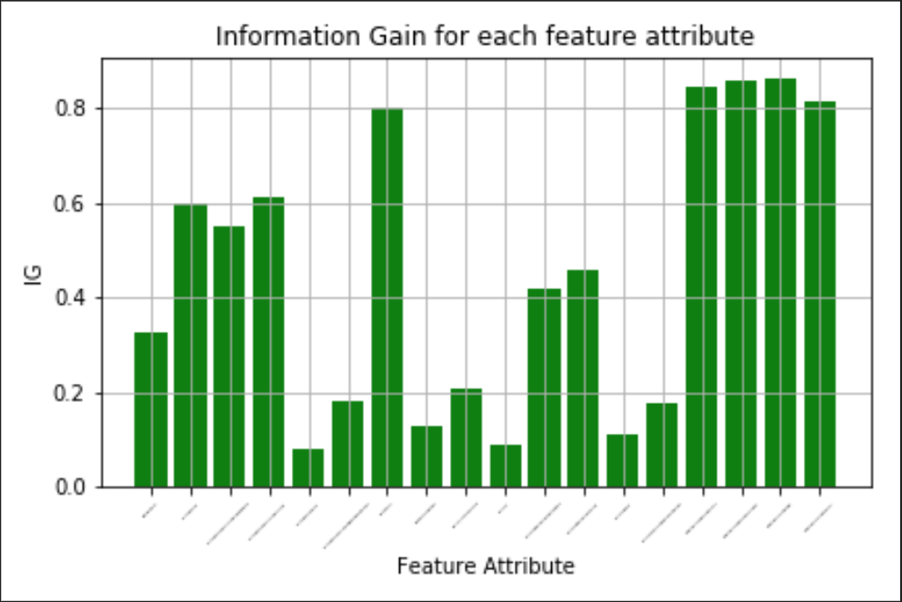
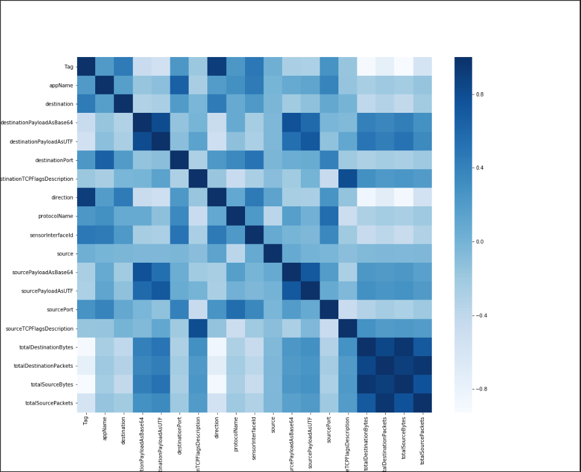

# SecurityAnalytics
Security analytics course at JHU Fall 2018

## Course Project - DDoS Analysis in NIDS
### Overview
In this project, we use several different machine learning algorithms to automatically predict whether the traffic is malicious or benign based on selected features. 
Then we compared their performances.
#### Dataset
 
 1. The whole dataset contains about more than 570,000 Network traffic flows, all of which being labeled either as “normal” or “attack”. 
 2. **Under-sampling** is applied to modify the original dataset to obtain a smaller and well-balanced dataset of 70,000 in size, with "normal" and "attack" data proportionally.
 3. Following are the attributes used for training
  
  
#### Models Applied
* Logistic Regression
* Random Forest
* K-Nearest Neighbours
* Neural Network (Multilayer Perceptron)

#### Approach Used
* Cross-validation 
 * training (9/10)
 * testing (1/10)
 * applied to all models
* Grid Search
 * adjusting parameters to optimize the result
 * only applied to logistic regression and random forest (other two are time-consuming)
* Comparsion
 * comparing the performance

#### Evaluation 
 1. Metrics Used for Classifiers
    * Accuracy -  (TP+TN) / Total
    * Sensitivity(Recall) - TP / (TP + FN) 
    * Specificity - TN / (TN + FP)
    * Precision - TP / (TP + FP)
    * False Positive Rate - FP / (TN + FP)
    * Running Time 
    * AUC
 2. Metrics Used for Attributes
    * information gain - histogram
    * relevance between each attribute - heat map
 3. Histogram
  
 4. Heatmap
  
 
 
