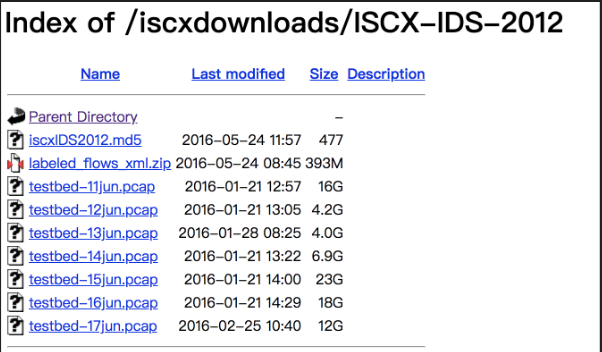

# SecurityAnalytics
Security analytics course at JHU Fall 2018

## Course Project - DDoS Analysis in NIDS
### Overview
In this project, we use several different machine learning algorithms to automatically predict whether the traffic is malicious or benign based on selected features. 
Then we compared their performances.
#### Dataset
 
 1. The whole dataset contains about more than 570,000 Network traffic flows, all of which being labeled either as “normal” or “attack”. 
 2. **Under-sampling** is applied to modify the original dataset to obtain a smaller and well-balanced dataset of 70,000 in size, with "normal"
 and "attack" data proportionally.
 First Header | Second Header
------------ | -------------
Content from cell 1 | Content from cell 2
Content in the first column| cuvuv | Content in the second column
